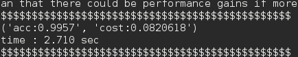
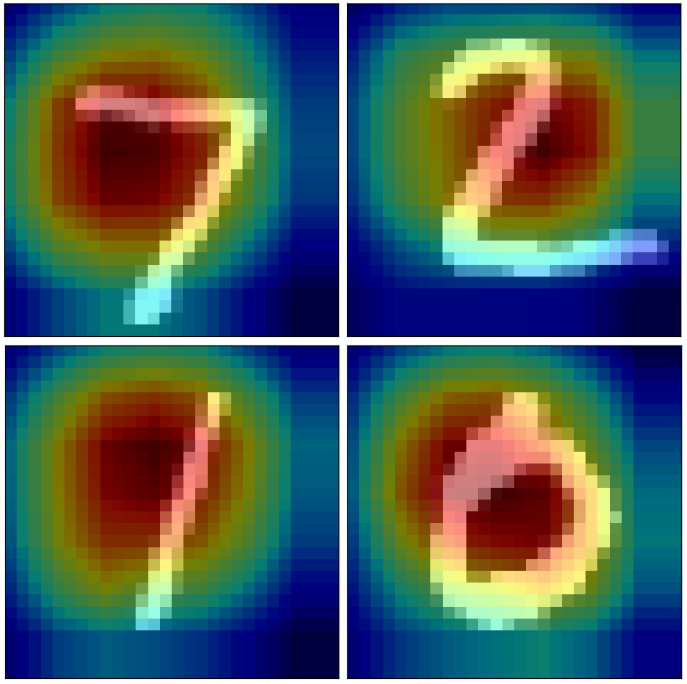

# MNIST Challenge 2017 by TF Kr
MNIST classification using residual network

### Result

## Requirements

- Python 2.7
- [TensorFlow 1.1.0](https://github.com/tensorflow/tensorflow)

## Environments

- NVIDIA GTX1080 (gpu mem > 7GB)

## Usage  

Input data 

    └── data
        ├── t10k-images-idx3-ubyte.gz
        ├── t10k-labels-idx1-ubyte.gz
        └── ... 

First, create checkpoint dir and download trained parameter files  

    └── model
        └── mnist_weight
            ├── checkpoint 
            ├── resnet-model-xx.index
            └── ...

You can download [**CHECKPOINT**](https://www.dropbox.com/s/7yn3jlvj5saywuy/mnist_weight.zip?dl=0) files (you don't need download. ckpt files were already included.)
  
To test a model
    
    $ python testing_mnist.py  

To train a model

    $ python training_mnist.py

### Weight visualization

### REF  
code : https://github.com/tensorflow/models/tree/master/resnet  

  
**Author**
>tkwoo  
  
> _             _____   _  __   __        __          
>| |__  _   _  |_   _| | |/ /   \ \      / /__   ___  
>| '_ \| | | |   | |   | ' /     \ \ /\ / / _ \ / _ \ 
>| |_) | |_| |   | |_  | . \ _    \ V  V / (_) | (_) |
>|_.__/ \__, |   |_(_) |_|\_(_)    \_/\_/ \___/ \___/ 
>       |___/                                         
  